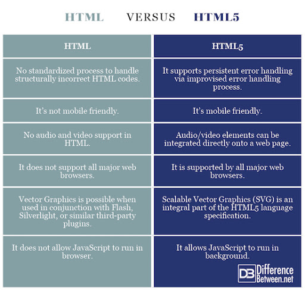

# Web Programming
### Here in this small article you are going to read some very important notes about web Programming
### So let's get started
- **STRUCTURE**
####  First of all , we should know the main parts and structures of the web pages . 
#### Each web page contain three main parts : Header, Body and Footer . and each of them has several parts to manage and control the page. as we see in the image below .

- **Process & Design **
#### To start to create any web page you should at the beginning make a simple draw to this page and explain all features ; Tittle , Menu , Paragraphs , Images and so on .
#### This draw called " WireFrame " and make it easy to start writing code after it .

######  fig(1)-"WireFrame"

#### You will start writing code with any Language you want , but in this article we are going to talk about HTML & CSS and show some example about codes with these languages .

#### You can design any page with the standard language "HTML"  to design the page and use "CSS" to make the style of the page .

- **HTML**
####  Hayper Text Markup Language
#### By using this language we can make the design of the page and add the all what we need Tittle, Paragraphs, Images ...  .

#### Like the image below 

- **CSS**
#### CSS is the language we use to style an HTML document. It describes how HTML elements should be displayed.
#### With code Like the image below 

#### **difference between HTML & HTML5**

#### The main differences between HTML & HTML5 are shown in the tables below :

### *** References ***

#### **HTML & CSS Design and Build Websites Book** ; By ***Jon DuCkeTT***
